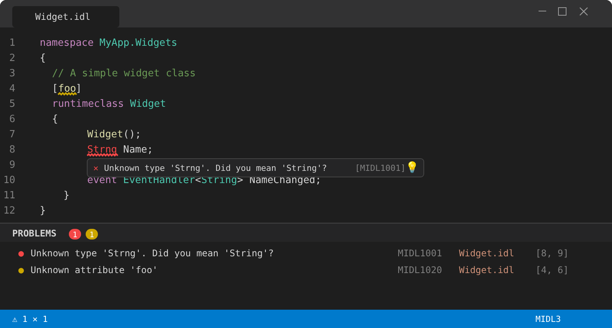
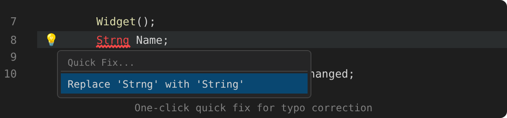
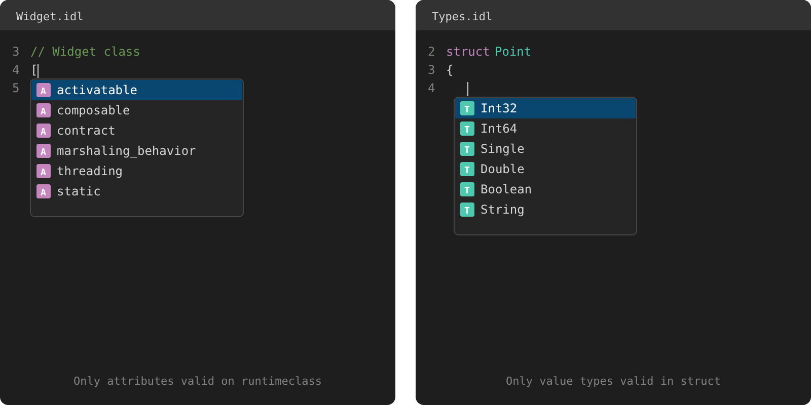
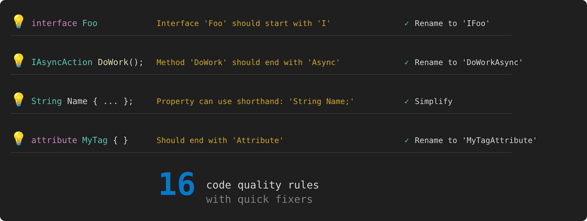
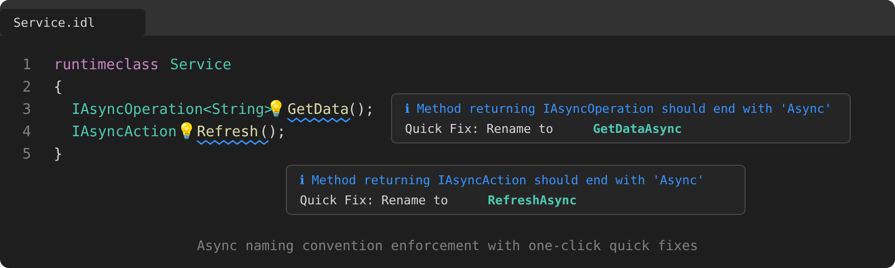
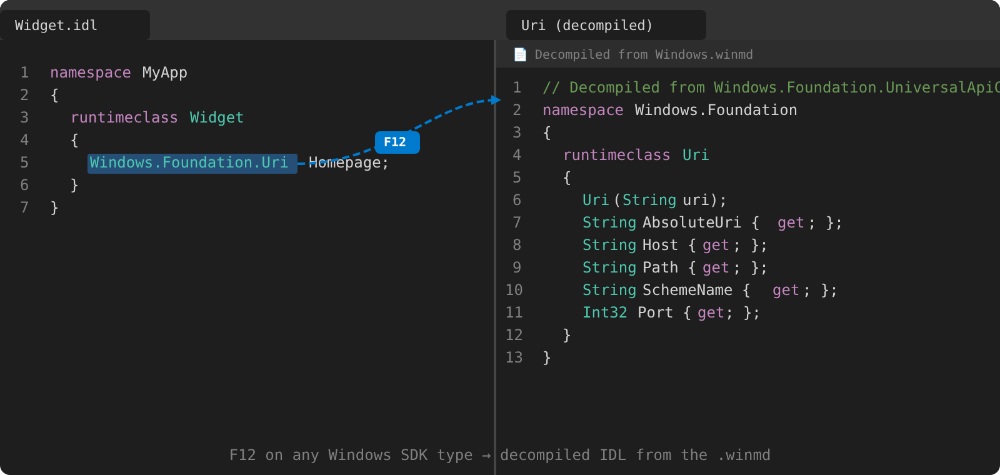
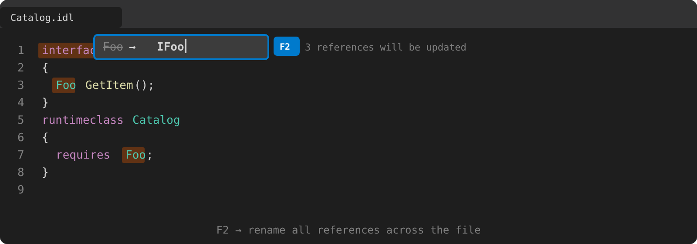
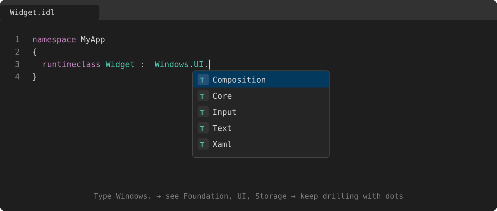
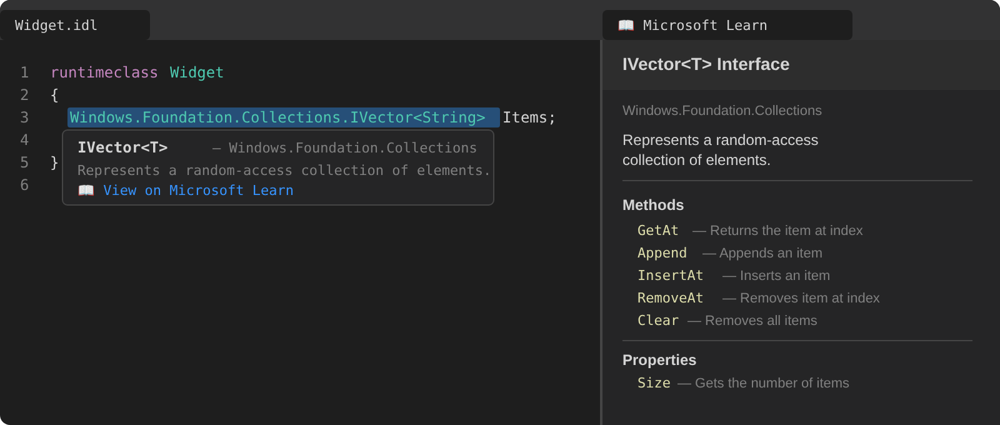

# MIDL Language Support for VS Code

**A complete MIDL3 development environment** — catch errors as you type, get context-aware completions, and ship correct WinRT APIs faster.

---

## ⚡ Real-Time Diagnostics

Errors and warnings surface instantly as you type — no build step required. Syntax errors, undefined types, MIDL2/MIDL3 migration issues, and duplicate definitions are caught with precise source locations and actionable messages.

---

## 🧠 Context-Aware IntelliSense

Completions adapt to where your cursor is. Inside an attribute bracket on a `runtimeclass`? You'll see `activatable`, `composable`, `contract`. Inside a `struct` body? Only value types that are valid there. Inside attribute arguments like `[threading(|`? You'll get `sta`, `mta`, `both`.

Includes WinRT primitives, collection/async types, external `.winmd` types, and trigger characters on `.` and space.

---

## 🎯 Code Quality

16 built-in code quality rules with one-click quick fixers — enforce WinRT naming conventions, simplify verbose patterns, and catch common mistakes.

### Async Naming Convention

Methods returning `IAsyncOperation` or `IAsyncAction` should follow the `Async` suffix convention. WinMIDL detects violations and offers one-click renames.

---

## 🔗 Navigation

### Go to Definition — F12 into Decompiled WinMD

**F12** on any Windows SDK type jumps to a decompiled IDL view straight from the `.winmd` — no source code needed.

### F2 Rename Symbol

Rename a symbol and all its references in one shot. Works across interface declarations, `requires` clauses, and return types.

---

## 🌐 Windows SDK Integration

### Namespace Drill-In

Type a dot after any Windows namespace and IntelliSense walks you through the hierarchy — `Windows.` → `UI.` → `Composition`, `Core`, `Xaml`…

### Microsoft Learn Integration

Hover any Windows SDK type to see its documentation inline, with a direct link to Microsoft Learn. The side panel shows full API docs without leaving VS Code.

---

---

## Features

### 🎨 Syntax Highlighting

Full TextMate grammar covering both MIDL3 and classic MIDL syntax:

- **Keywords** — `namespace`, `runtimeclass`, `interface`, `delegate`, `struct`, `enum`, `event`, `import`, `apicontract`, and classic keywords like `coclass`, `library`, `typedef`, `union`
- **Types** — WinRT primitives (`Boolean`, `Int32`, `String`, `Guid`, `Object`, …) and classic types (`HRESULT`, `BSTR`, `IUnknown`, `IDispatch`, …)
- **Qualified type names** — Dotted names like `Windows.Foundation.Uri` highlighted as types
- **Attributes** — Keywords inside `[...]` brackets (e.g., `uuid`, `contract`, `activatable`, `composable`, `threading`, `deprecated`, and many more)
- **GUIDs** — Inline GUID literals colorized as constants
- **Strings, numbers, comments** — Double-quoted strings with escape sequences, hex (`0xFF`) and decimal literals, line (`//`) and block (`/* */`) comments
- **Storage modifiers** — `static`, `partial`, `unsealed`, `protected`, `overridable`, `get`, `set`, `out`, `ref`, `const`

### 📝 Code Snippets

19 snippets for common MIDL3 patterns — type a prefix and press Tab:

| Prefix | Description |
|--------|-------------|
| `namespace` | Namespace declaration |
| `runtimeclass` | Runtime class with default constructor |
| `unsealedruntimeclass` | Unsealed (composable) runtime class with base class |
| `staticruntimeclass` | Static-only runtime class |
| `interface` | Interface declaration |
| `interfacerequires` | Interface with `requires` clause |
| `delegate` | Delegate type |
| `struct` | Struct with fields |
| `enum` | Enumeration |
| `flagsenum` | Flags enumeration with `[flags]` attribute |
| `propget` | Read-only property (`{ get; }`) |
| `proprw` | Read-write property (shorthand) |
| `event` | Typed event (`TypedEventHandler`) |
| `asyncmethod` | Async method returning `IAsyncOperation<T>` |
| `asyncaction` | Async method returning `IAsyncAction` |
| `contract` | Contract version attribute |
| `apicontract` | API contract definition with `[contractversion]` |
| `versionedblock` | Versioned member block with contract attribute |
| `import` | Import directive |

### 🖱️ Hover Information

Hover over any token for contextual documentation — keywords, built-in types, user-defined types, and external `.winmd` symbols.

### 🔗 Go to Definition

**Ctrl+Click** or **F12** on any type or member name to jump to its declaration. Also works on attribute names — F12 on `[threading]` or `[contract]` navigates to the SDK attribute type definition (decompiled from `.winmd`).

### 🔎 Find All References

**Shift+F12** to find every usage of a symbol in the document.

### ✍️ Signature Help

Parameter hints triggered by `(` and `,` — shows full method/constructor/delegate signatures with active parameter highlighting. Also works inside attribute arguments: `[contract(|` shows `(ContractName, version)`, `[composable(|` shows `(FactoryType, access, version)`, etc.

### 📂 Code Folding

Collapse namespaces, runtime classes, interfaces, structs, enums, and versioned blocks using the editor fold controls.

### 🎯 Semantic Highlighting

14 semantic token types with declaration/static modifiers — identifiers resolved against the compilation for precise highlighting.

### 📐 Document Formatting

**Shift+Alt+F** — consistent 4-space indentation, normalized spacing, blank lines between declarations, trailing whitespace cleanup.

### 📋 Document Outline

Hierarchical symbol tree in **Outline** view and **Breadcrumbs** — namespaces, types, and members.

### 🔢 Namespace Type Count Code Lens

Each namespace block shows a summary of its contained types — e.g., `2 enums, 3 classes, 1 interface`.

### 📝 Doc Comments (`///`)

Triple-slash comments are parsed as XML doc comments:
- **Hover** shows `
` text for documented types and members
- **Autocomplete** generates `<param>` and `<returns>` skeletons
- **`/doc` CLI switch** emits `.xdc` XML doc comment files

### 🖥️ Inactive Region Graying

Code inside `#ifdef` / `#ifndef` blocks that are inactive (based on defined macros) is rendered with reduced opacity. Configure active defines via `midl.defines` in settings.

### 📊 Interactive Class Diagram

**Command**: `MIDL: Show Class Diagram`

Generates a UML-style class diagram from the current IDL file:
- Color-coded type boxes (enum, struct, interface, class, delegate)
- UML inheritance and implementation arrows
- **Drag nodes** to rearrange the layout
- **Right-click → Copy as PNG** to clipboard
- **Ctrl+scroll** to zoom in/out

### 📄 Language Configuration

Comment toggling, bracket matching, auto-closing pairs, smart indentation, and doc comment continuation — all configured out of the box.

---

## Configuration

| Setting | Type | Default | Description |
|---------|------|---------|-------------|
| `midl.strictMode` | `boolean` | `true` | Enable strict MIDL3 mode. Classic MIDL constructs (coclass, library, typedef, etc.) produce warnings. Disable for mixed MIDL2/MIDL3 codebases. |
| `midl.codeQualityHints` | `boolean` | `true` | Show code quality hints (naming conventions, empty types, etc.) |
| `midl.useWindowsSdk` | `boolean` | `true` | Automatically reference Windows.winmd from the installed Windows SDK for type completion and F12 navigation. |
| `midl.windowsSdkVersion` | `string` | `"latest"` | Windows SDK version to use. Use the **MIDL: Select Windows SDK Version** command to pick from installed versions. |
| `midl.flatSdkTypeCompletions` | `boolean` | `false` | Show all SDK types by short name in completions (e.g. `Button`, `Control`). When off, only namespace names appear and you drill in with dot notation. |
| `midl.fetchSdkDocs` | `boolean` | `true` | Fetch type descriptions from Microsoft Learn on hover. Requires internet access. |
| `midl.inlineDocsBrowser` | `boolean` | `true` | Open Microsoft Learn documentation in a VS Code side panel instead of the external browser. |
| `midl.defines` | `array` | `[]` | Preprocessor defines for inactive region detection (e.g., `["FEATURE_X", "DEBUG"]`). |
| `midl.serverPath` | `string` | `"midl"` | Path to the MIDL CLI executable. The extension ships its own copy — you shouldn't need to change this unless using a custom build. |

---

## Getting Started

### 1. Install the Extension

Install **MIDL Language Support** from the VS Code marketplace or from a `.vsix` package.

### 2. Open a `.idl` File

The extension activates automatically when you open any `.idl` file. All features — syntax highlighting, diagnostics, completions, hover, and more — are available immediately.

---

## Requirements

- **VS Code 1.85+** — Minimum supported VS Code version

The extension ships a self-contained Native AOT binary — no .NET SDK or runtime installation required.

---

## Known Limitations

- **Go to Definition** — Works within the current file, across `.idl` files (via `winmidl.json` or `// @ref:` directives), and for external `.winmd` types (decompiled view)
- **Full document sync** — The entire document is re-sent and reparsed on every keystroke (incremental text sync planned)
- **No refactoring** — Code actions are available but full refactoring support is still growing

---

## License

MIT
